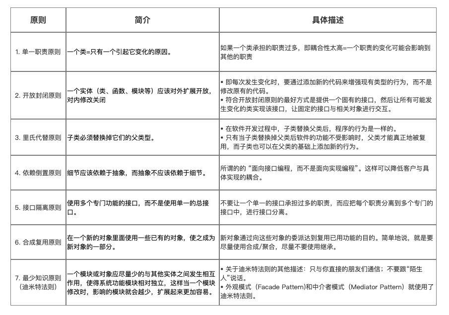
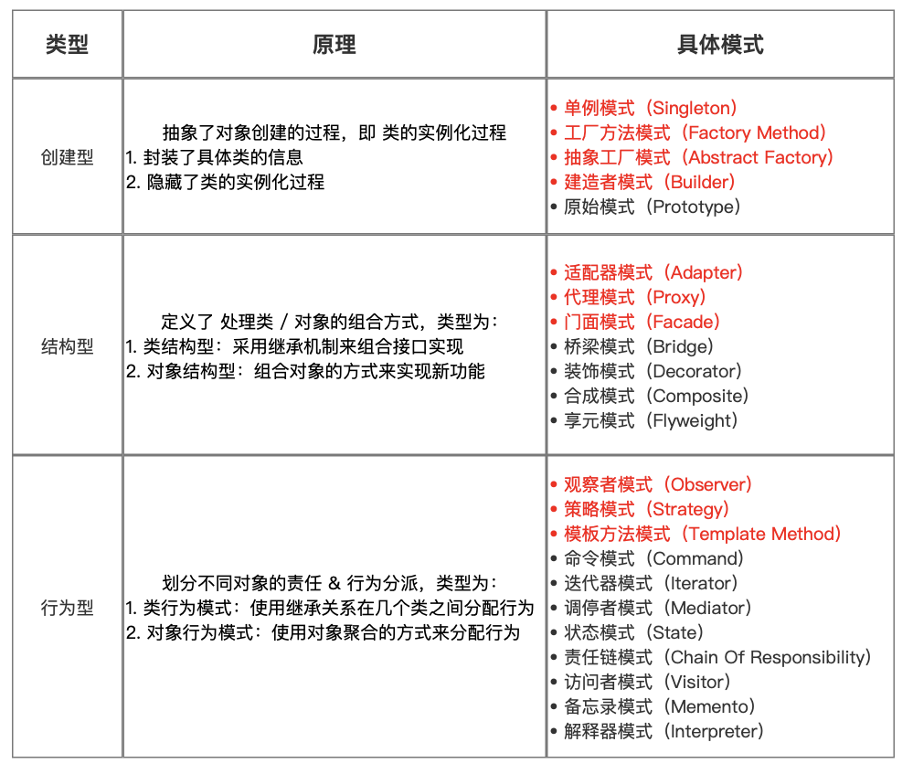
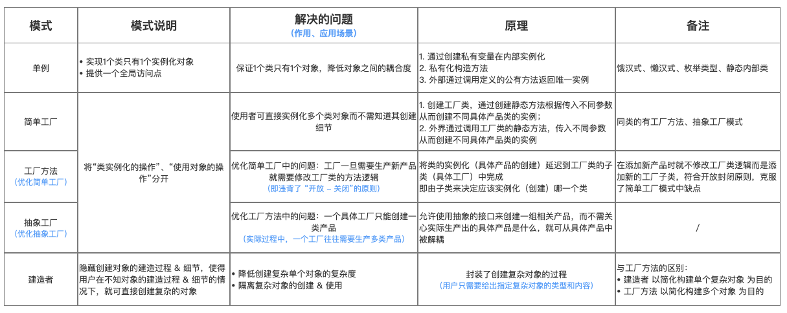
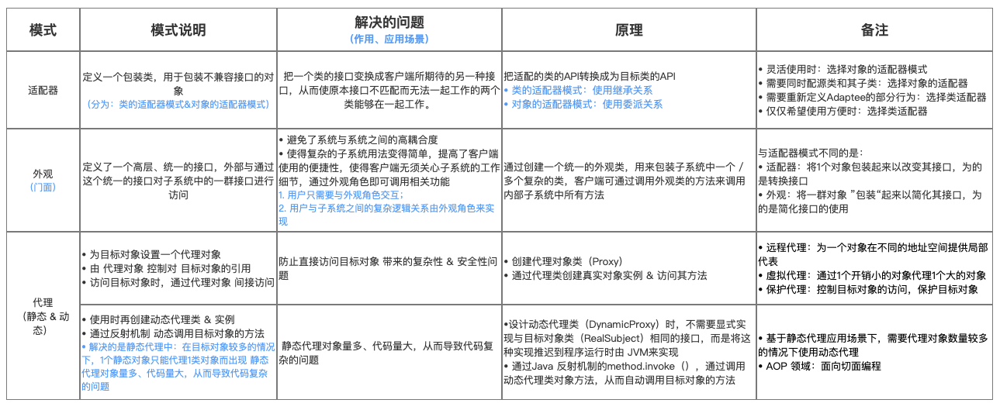
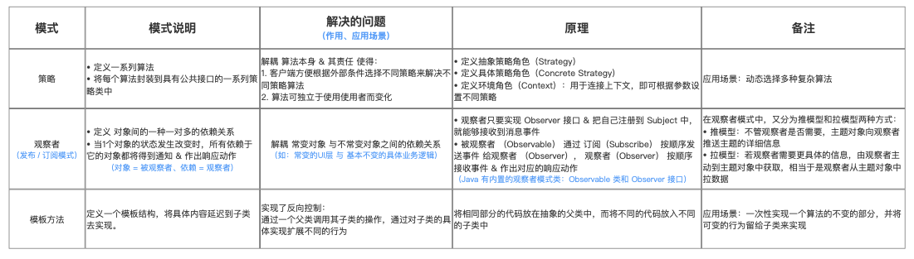

# 设计模式

## 1.设计原则

## 2.类型

设计模式的类型总共分为：3大类、23种具体设计模式，具体如下：

## 3.常用设计模式

针对三种设计模式类型，常见的设计模式是：

- 创建型：单例模式、工厂方法模式（及变式:工厂方法模式、抽象工厂模式）、建造者模式；
- 结构型：适配器模式、代理模式、门面（外观）模式；
- 行为型：策略模式、观察者模式

### 3.1 创建型

### 3.2 结构型

### 5.3 行为型

Asdasd
