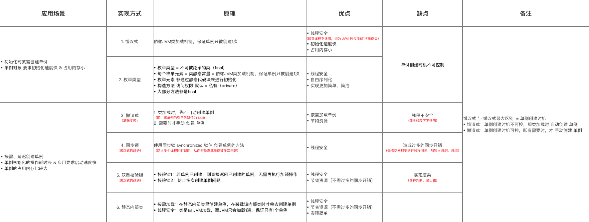

# 创建型 - 单例模式(Singleton pattern)

## 类图

使用一个私有构造函数、一个私有静态变量以及一个公有静态函数来实现。  
私有构造函数保证了不能通过构造函数来创建对象实例，只能通过公有静态函数返回唯一的私有静态变量。

## 实现方式总结

## 使用场景

- Logger Classes
- Configuration Classes
- Accesing resources in shared mode
- Factories implemented as Singletons

### JDK

- java.lang.Runtime#getRuntime()
- java.awt.Desktop#getDesktop()
- java.lang.System#getSecurityManager()
